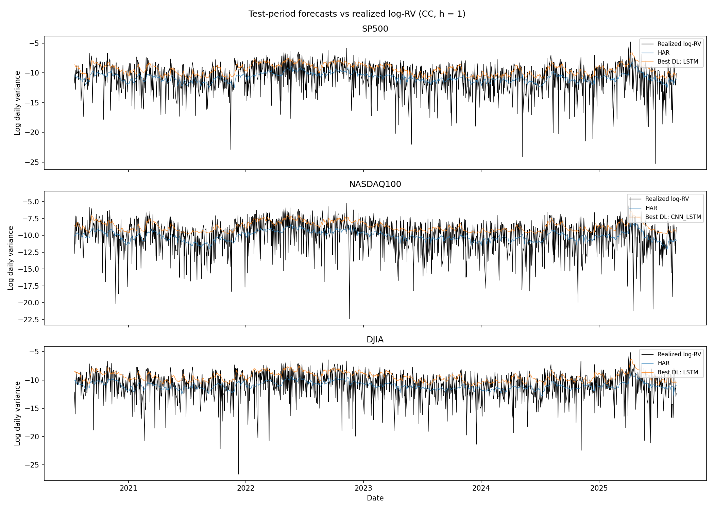
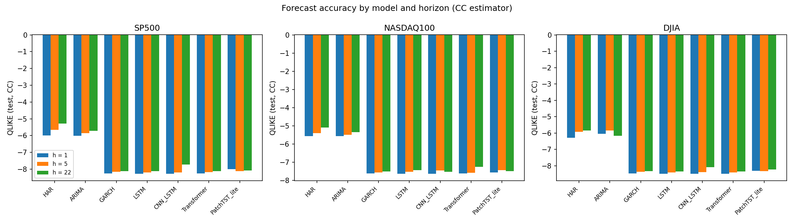
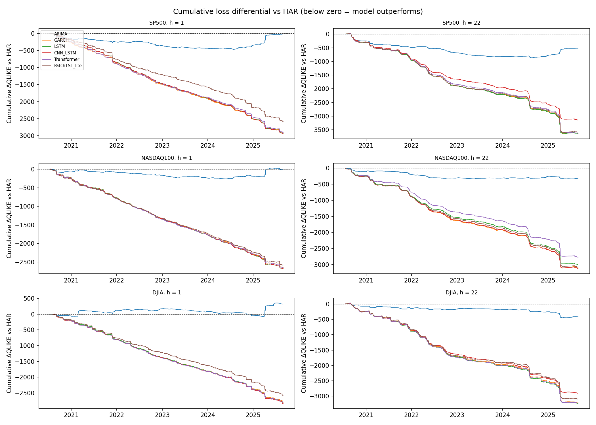

# Deep Learning and Transformer Architectures for Volatility Forecasting

Independent implementation of the experimental framework presented in:

> Taneva-Angelova, G., & Granchev, D. (2025).
> *Deep Learning and Transformer Architectures for Volatility Forecasting:
> Evidence from U.S. Equity Indices.*
> Journal of Risk and Financial Management, 18(12), 685.
> https://doi.org/10.3390/jrfm18120685

## Overview

This project investigates volatility forecasting for major U.S. equity indices
using classical econometric models and modern deep learning architectures.

The implementation evaluates:

- ARIMA (order selected by AIC)
- GARCH(1,1)
- HAR-RV
- LSTM
- CNN-LSTM
- Vanilla Transformer
- PatchTST-lite

Forecasts are evaluated across:

- S&P 500
- NASDAQ 100
- Dow Jones Industrial Average

and at forecasting horizons of:

- 1 trading day
- 5 trading days
- 22 trading days

The primary target is log realized variance, constructed from daily market data.
All models are evaluated on a unified grid: 3 indices × 3 RV estimators
(Close-to-Close, Parkinson, Yang–Zhang) × 3 horizons = 27 forecast
configurations, with every model predicting an identical, frozen set of test
targets per configuration (a prerequisite for valid Diebold–Mariano comparisons).

## Research Question

Can sequence-based deep learning and Transformer architectures improve
volatility forecasting relative to established econometric models?

The project follows the experimental structure of the reference paper while
independently implementing the data pipeline, volatility estimators, models,
forecasting procedure, and evaluation framework.

## Methodology

### Data

Daily OHLC data are collected for:

| Index | Symbol |
|---|---|
| S&P 500 | `^GSPC` |
| NASDAQ 100 | `^NDX` |
| DJIA | `^DJI` |

The current implementation uses Yahoo Finance data (2000-01 → 2025-09).

The reference paper uses Investing.com data. This difference is therefore
treated as a replication deviation rather than assuming the two datasets are
identical.

### Realized Variance

Three daily variance estimators are implemented:

1. Close-to-Close: `RV = r²`
2. Parkinson: `RV = ln(H/L)² / (4 ln 2)`
3. Yang–Zhang: 22-day rolling window (window size assumed; the paper does not
   specify it)

The forecasting target is:

`y_t = log(RV_t)`

with a 1e-12 variance floor applied before the log transform. Predictions are
transformed back to variance space before calculating forecast errors.

### Temporal Setup

A 120-trading-day lookback window is used for sequence models.

Forecast horizons: `h ∈ {1, 5, 22}`

The dataset is split chronologically using an 80/20 train-test split (test
period begins ≈ August 2020, capturing the COVID aftermath, the 2022
inflation shock, and the 2023–2025 adjustment, mirroring the paper's design).

No future observations are used when calculating training normalization
statistics. Random train/test splitting is intentionally avoided because it
would introduce temporal leakage into the forecasting experiment.

### Models

#### Classical Models

**ARIMA** — classical univariate baseline; the order is selected by AIC over
a grid (p, q ≤ 3, d ≤ 1) on the training sample of log-RV, with parameters
held fixed and re-filtered at each test origin (`apply(refit=False)`).

**GARCH(1,1)** — fitted to daily log-returns (normal innovations) with
anchored expanding refits every 22 test observations; conditional-variance
forecasts are compared against all three RV estimators.

**HAR-RV** — heterogeneous autoregressive model with daily, weekly (5-day)
and monthly (22-day) realized-variance components:

`RV_{t+1} = β0 + βd·RV^(d) + βw·RV^(w) + βm·RV^(m) + ε`

implemented on log-RV representations, with weekly/monthly components
aggregated in variance space before the log transform. Refit on an expanding
window every 22 test observations.

#### Deep Learning Models

**LSTM** — stacked LSTM (2 × 64 units) over the 120-day input window.

**CNN-LSTM** — temporal convolutional front-end (two Conv1d + ReLU layers,
max-pooling) before the sequence is passed to an LSTM.

**Vanilla Transformer** — encoder-only Transformer (2 layers, 4 heads,
d_model 64) with sinusoidal positional encoding and mean pooling.

**PatchTST-lite** — lightweight PatchTST-inspired architecture: channel-independent
patching (patch length 12, stride 12) before Transformer-style encoding.

The reference paper does not provide every implementation detail required to
uniquely reconstruct its architectures. Consequently, this implementation
should be considered an approximation of the described architectures
(hidden sizes, learning rate, and early-stopping settings are documented
assumptions).

All deep learning models are trained on log-RV with a QLIKE loss
(`mean(log v̂ + v/v̂)` in log space), Adam (lr 1e-3), batch size 64,
gradient clipping, and early stopping (patience 10) on the last 63 training
targets as an anchored validation set.

## Evaluation

Models are evaluated on the held-out chronological test period using:

- MAE and RMSE (variance scale, after back-transformation)
- QLIKE: `log v̂ + v/v̂` (plain form, variance scale)
- Diebold–Mariano tests vs the HAR-RV benchmark and the best classical model
  per configuration, with Newey–West (Bartlett) HAC variance at lag h−1
  (overlap correction) and a lag-h robustness check
- Overfitting diagnostics: test − train QLIKE gap and best-epoch
  distributions

Model-level diagnostics include validation QLIKE at the early-stopping
checkpoint, best-epoch distribution, and per-date loss differentials
(cumulative ΔQLIKE paths).

## Headline Findings of This Replication

- Deep learning models (LSTM / CNN-LSTM / Transformer) cluster tightly and
  significantly outperform HAR-RV and ARIMA on Close-to-Close and Parkinson
  targets (DM significant at 5% across all indices and horizons).
- The size of the classical-vs-DL gap is estimator-dependent: on the smooth
  Yang–Zhang target all models converge (within ~0.08 QLIKE) and classical
  models are competitive — consistent with QLIKE's optimum being the
  variance-scale mean, which penalizes log-space predictors on heavy-tailed
  targets (Close-to-Close log-RV has std ≈ 2.5 vs ≈ 0.7 for Yang–Zhang).
- PatchTST-lite underperforms the other deep architectures, likely reflecting
  the reduced configuration assumed here.

### Forecast paths vs realized log-RV (test period, Close-to-Close, h = 1)



### QLIKE by model and horizon (Close-to-Close)



### Cumulative loss differential vs HAR-RV (Close-to-Close, h = 1 and h = 22)

Below zero means the model outperforms HAR-RV up to that date.



## Current Status

**Work in progress.**

The current implementation reproduces the major experimental components of
the reference study, but it should not yet be considered an exact numerical
replication of the published results.

Known sources of potential discrepancy include:

- Yahoo Finance vs. Investing.com market data
- incomplete implementation details in the published architecture
- realized-variance construction and scaling conventions
- forecasting/refitting details
- ARIMA specification
- Transformer/PatchTST hyperparameters
- exact QLIKE implementation (variant and scale)
- walk-forward validation details

The purpose of the ongoing work is to identify and isolate these differences
rather than tune the implementation to reproduce published numbers.

## How to Run

Developed and executed on Kaggle Notebooks (CPU or GPU; GPU reduces the deep
learning stage from ~2–3 h to under 1 h). Requires Python 3.12 with numpy,
pandas, matplotlib, scipy, scikit-learn, statsmodels, arch, torch, yfinance.

Run the notebook cells strictly in order; outputs are written to the working
directory as CSVs, PNGs, and `.tex` tables:

| File | Contents |
|---|---|
| `results_summary.csv` | QLIKE/RMSE/MAE for all 189 (configuration × model) rows |
| `results_panels.csv` | metric pivots for all 9 index × estimator panels |
| `dm_tests.csv` | DM statistics, both HAC lags, both benchmarks, verdicts |
| `test_losses_per_date.csv` | per-date QLIKE losses |
| `forecast_dump.csv` | every test-date forecast per model with realized values |
| `fig_predicted_vs_realized.png` | test-period paths: realized vs HAR vs best DL |
| `fig_qlike_bars.png` | QLIKE by model × horizon |
| `fig_cumulative_loss_diff.png` | cumulative ΔQLIKE vs HAR |
| `table_*_{QLIKE,RMSE,MAE}.tex` | 18 LaTeX tables |

## Repository Structure

```text
.
├── notebook.ipynb
├── data/
│   └── ...
├── results/
│   ├── results_summary.csv
│   ├── results_panels.csv
│   ├── forecast_dump.csv
│   └── ...
├── figures/
│   └── ...
├── README.md
└── requirements.txt
```
